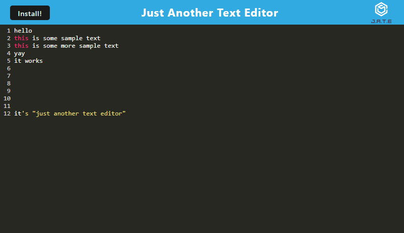

# Progressive Web Applications (PWA): Text Editor

The application is a text editor that runs in the browser. The app is a single-page application that meets the PWA criteria. Additionally, it features a number of data persistence techniques that serve as redundancy in case one of the options is not supported by the browser. The application also functions offline.

The application can be used locally on a device by cloning the repository from Github or can be used via the deployed Heroku link below.

 ## Table of Contents  
[1. Description](#Description)  
[2. Acceptance Criteria](#Acceptance-Criteria)  
[3. Screenshot](#Screenshot)  
[4. Installation](#Installation)  
[5. Tests](#Tests)  
[6. License](#License)  
[7. Github Repository](#Github-Repository)   
[8. Contact](#Contact)  

## Description

* When the application starts, the IndexedDB will create a database to store user data. 
* When a user enters data in the application and then closes and reopens, the previously entered data will be retrieved.
* The install button on the application downloads the application as a desktop icon.

## User Story

```md
AS A developer
I WANT to create notes or code snippets with or without an internet connection
SO THAT I can reliably retrieve them for later use
```

## Acceptance Criteria

```md
GIVEN a text editor web application
WHEN I open my application in my editor
THEN I should see a client server folder structure
WHEN I run `npm run start` from the root directory
THEN I find that my application should start up the backend and serve the client
WHEN I run the text editor application from my terminal
THEN I find that my JavaScript files have been bundled using webpack
WHEN I run my webpack plugins
THEN I find that I have a generated HTML file, service worker, and a manifest file
WHEN I use next-gen JavaScript in my application
THEN I find that the text editor still functions in the browser without errors
WHEN I open the text editor
THEN I find that IndexedDB has immediately created a database storage
WHEN I enter content and subsequently click off of the DOM window
THEN I find that the content in the text editor has been saved with IndexedDB
WHEN I reopen the text editor after closing it
THEN I find that the content in the text editor has been retrieved from our IndexedDB
WHEN I click on the Install button
THEN I download my web application as an icon on my desktop
WHEN I load my web application
THEN I should have a registered service worker using workbox
WHEN I register a service worker
THEN I should have my static assets pre cached upon loading along with subsequent pages and static assets
WHEN I deploy to Heroku
THEN I should have proper build scripts for a webpack application
```

## Screenshot



## Installation
  
The deployed application can be viewed at the Heroku Link. To use the application locally, clone the Github repository and enter the following terminal commands:
```
    - npm i
    - npm build
    - npm start dev
```
The application can then be viewed locally on localhost:3001

## Tests 

    None

## License
   
    None

## Github Repository
 [github.com/HuwRichmond/Progressive-Web-Applications-PWA-Text-Editor](https://github.com/HuwRichmond/Progressive-Web-Applications-PWA-Text-Editor)

## Contact

Created by Huw Richmond

[Github.com/HuwRichmond](https://github.com/HuwRichmond)